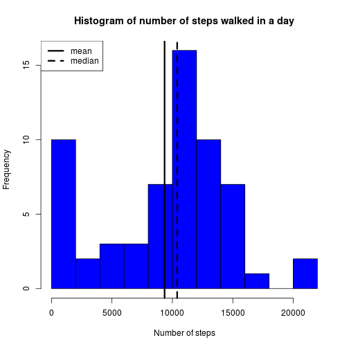
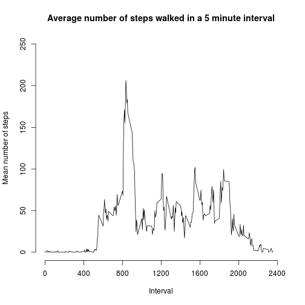
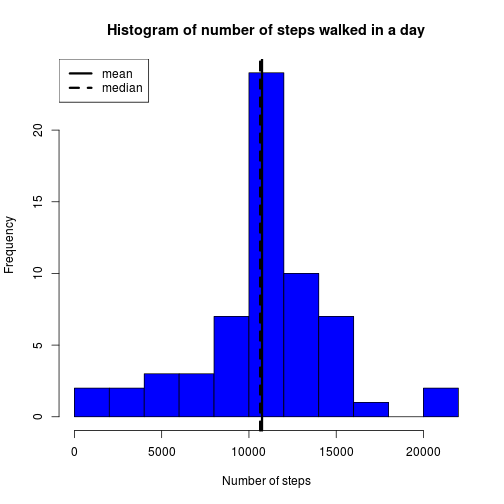
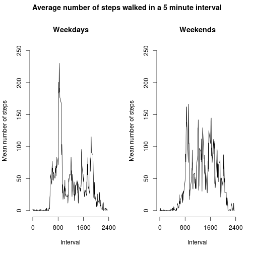

---
title: "Project 1"
author: "Alan Hills"
date: "13 June 2015"
output: html_document
---

### Import necessary packages:


```r
library(data.table)
library(nnet)
```


### Download file, extract data and convert to data.table:


```r
download.file("https://d396qusza40orc.cloudfront.net/repdata%2Fdata%2Factivity.zip","project_data.zip", 
                    method="curl")
project_data <- read.csv(unz("project_data.zip","activity.csv"))
project_data.table <-data.table(project_data)
```

================================================================================

### Calculate the sum of steps for each date and plot a histogram.


```r
setkey(project_data.table,date)
sum_of_steps <- as.data.frame(project_data.table[, sum(steps,na.rm = TRUE), by = date])
mean_steps <- mean(sum_of_steps[,2])
median_steps <- median(sum_of_steps[,2])
hist(sum_of_steps[,2],breaks = 10, col="blue",xlab = "Number of steps", 
                main = "Histogram of number of steps walked in a day")
abline(v=mean_steps,lwd=3)
abline(v=median_steps,lwd=3, lty=2)
legend("topleft", c("mean","median"), lwd=3, lty=1:2)
```

 

Mean = 9354.2295082 :  Median = 10395

================================================================================

### Calculate average number of steps for each 5 minute interval


```r
setkey(project_data.table, interval)
activity_pattern <- as.data.frame(project_data.table[, mean(steps,na.rm = TRUE), by = interval])
plot(activity_pattern,xlim=c(0,2400), ylim=c(0,250), type="l", axes=FALSE, xlab="Interval", 
                ylab="Mean number of steps")
axis(1, at = c(0,400,800,1200,1600,2000,2400))
axis(2, at = c(0,50,100,150,200,250))
title("Average number of steps walked in a 5 minute interval")
```

 

```r
max_interval = activity_pattern[which.is.max(activity_pattern[,2]),1]
```

Interval with maximum average number of steps is 835

================================================================================

### Replace NAs with average for the same interval where data exists.


```r
# Vectorise these loops for efficiency!
for (i in 1:dim(project_data.table)[1]){
    if (is.na(project_data.table[i]$steps)){
        project_data.table[i]$steps <- 
                as.integer(activity_pattern[which(activity_pattern$interval == project_data.table[i]$interval),2])
    }
}
new_sum_of_steps <- as.data.frame(project_data.table[, sum(steps,na.rm = TRUE), by = date])
mean_steps <- mean(new_sum_of_steps[,2])
median_steps <- median(new_sum_of_steps[,2])
hist(new_sum_of_steps[,2],breaks = 10, col="blue",xlab = "Number of steps", 
                    main = "Histogram of number of steps walked in a day")
abline(v=mean_steps,lwd=3)
abline(v=median_steps,lwd=3, lty=2)
legend("topleft", c("mean","median"), lwd=3, lty=1:2)
```

 

Mean = 1.074977 &times; 10<sup>4</sup> :  Median = 10641

================================================================================

### Differences between weekdays and weekends

Add a new piece of data to identify where data is a weekday of weekend, then plot the two separate time series plots.


```r
project_data.table$weekend <- (weekdays(as.Date(project_data.table$date)) == "Saturday" 
                                             | weekdays(as.Date(project_data.table$date)) == "Sunday")
par(mfcol=c(1,2))
par(oma=c(0,0,2,0))
activity_pattern_weekday <- as.data.frame(project_data.table
                                [project_data.table$weekend == FALSE][, mean(steps,na.rm = TRUE), by = interval])
plot(activity_pattern_weekday,xlim=c(0,2400), ylim=c(0,250), type="l", axes=FALSE, xlab="Interval", 
                                ylab="Mean number of steps")
axis(1, at = c(0,800,1600,2400))
axis(2, at = c(0,50,100,150,200,250))
title("Weekdays")
activity_pattern_weekend <- as.data.frame(project_data.table
                                [project_data.table$weekend == TRUE][, mean(steps,na.rm = TRUE), by = interval])
plot(activity_pattern_weekend,xlim=c(0,2400), ylim=c(0,250), type="l", axes=FALSE, xlab="Interval", 
                                ylab="Mean number of steps")
axis(1, at = c(0,800,1600,2400))
axis(2, at = c(0,50,100,150,200,250))
title("Weekends")
title("Average number of steps walked in a 5 minute interval", outer = TRUE)
```

 
